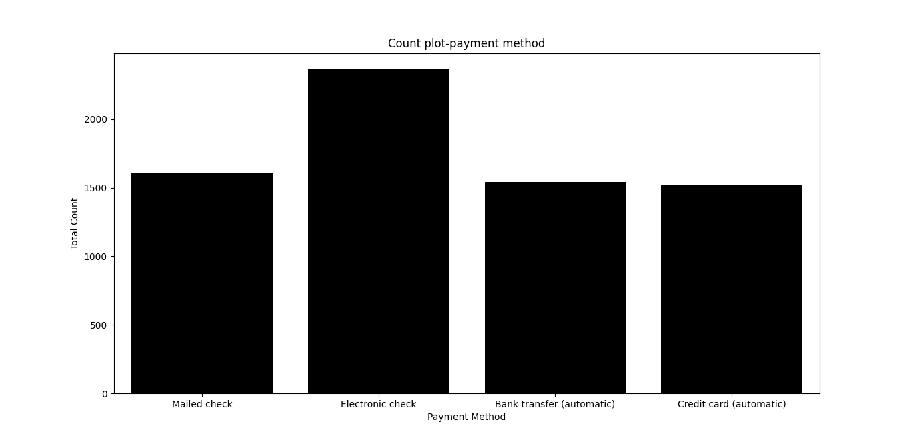

# Telco_customer_churn-data


### Introduction

Telco_customer_churn data gives us a brief idea about the customer churn rate in the Telecommunications industry across the world.The main aim of this dataset is to predict the customer churn data that is the number of customers who left the company this quarter and the number of customers who remained in the company and to suggest the solutions to prevent the considerable churns.


Churn is a one of the biggest problem in the telecom industry. Research has shown that the average monthly churn rate among the top 4 wireless carriers in the US is 1.9% - 2%.

### The data set includes information about:

- customers who left within the last month – the column is called Churn

- Services that each customer has signed up for – phone, multiple lines, internet, online security, online backup, device protection, tech support, and streaming TV and movies
- Customer account information – how long they’ve been a customer, contract, payment method, paperless billing, monthly charges, and total charges
- Demographic info about customers – gender, age range, and if they have partners and dependents.

```commandline
import  numpy as np
import pandas as pd
import seaborn as sns
import matplotlib.pyplot as plt

df=pd.read_excel("dataset.xlsx")
print(df)

print(df.shape)
```
shape function() gives the number of rows and columns.

From the above code it is to be noted that this dataframe consists of 7043 rows and 33 columns.

1.Distribution of the churn data in this dataset

```commandline
print(df['Churn Label'].value_counts())
```
value_counts()function returns object containing counts of unique values,it is handy for categorical data

From  the above code it is to be known that out of 7093(100%) customers,5174 (73.5%)customers remained with the company,while 1869 (26.5%)customers Left the company this quarter.

```commandline
sns.countplot(x='Churn Label',data=df,color='grey')
plt.title('churn count')
plt.xlabel('Churn Label')
plt.ylabel('Total count')
plt.show()
```


- countplot is applicable only for categorical data to count observations in each category.
- x-axis shows about the churn label.
- y-axis shows about the Total count.

2.read the file and explain data types statistically as well as how python is reading it. Please let us know if any data type is read wrong.

```commandline
print(df.dtypes)
```
- dtype()function is used to create a data type object
- It can be observed that the TotalCharges has an object data type which is read wrong but in real it has to be read as float data type.For changing the data type of Total Charges -object into float we have to use the following code.

```commandline
df['Total Charges'] = pd.to_numeric(df['Total Charges'],errors='coerce')
print(df.dtypes)
```
- pd.to_numeric is an inbuilt function which is used to convert an argument like object into a numeric data type

- now the data type of Total Charges will be changed from object to float64.

3.apply appropriate statistical measures using python based on data types.

- The statistical measures are of two types:1.Measures of central tendency which comprises of mean,median,and mode while the other is 2.Measures of Dispersion which comprises of standard deviation which is represented as std,variance which is represented as var,interquartile range which is represented as iqr and max,min.

```commandline
print(df.head(5))

print(df.mean())
print(df.median())

```
- head()function reads the first 5 records.
- mean()function gives the mean of the values for the requested axis
- median function() gives the median value that is 50th percentile of the set of all observations.

```commandline
print(df['Longitude'].mode(),
      df['Payment Method'].mode(),
      df['Gender'].mode(),
      df['Paperless Billing'].mode(),
      df['Contract'].mode(),
      df['Internet Service'].mode(),
      df['Monthly Charges'].mode(),
      df['Total Charges'].mode(),
      df['Churn Label'].mode())
```
- Mode() function is used for numerical as well as for Categorical data types.it is used to know about the observations that occurs more frequently.

**standard deviation:**

- It is a measure of the amount of variation or dispersion of a set of values.It is nothing but the square root of variance.

```commandline
print(df.std())
```
**variance:**

- Variance is a measure of dispersion that takes into account the spread of all data points in a data set.Normally,it is used along with the standard deviation which is known as the square root of variance.

```commandline
print(df.var())
```

**IQR**-INTER QUARTILE RANGE:

- It is a measure of statistical dispersion,which is the spread of the data.The IQR may also defined as the difference between the 75th and 25th percentiles of the data,that is it is the difference between the first and third quartiles (Q1 and Q3).

- The 'middle half' of the data is between the first and third quartile.

- The first quartile is the value in the data that separates the bottom 25% of values from the top 75%.

- The third quartile is the value in the data that separates the bottom 75% of the values from the top 25%.

The Interquartile range of some values are as follows:

```commandline
q75, q25 = np.percentile(df['Tenure Months'], [75 ,25])
iqr = q75 - q25
print(iqr)

q75, q25 = np.percentile(df['Monthly Charges'], [75 ,25])
iqr = q75 - q25
print(iqr)

q75, q25 = np.percentile(df['Churn Score'], [75 ,25])
iqr = q75 - q25
print(iqr)

q75, q25 = np.percentile(df['CLTV'], [75 ,25])
iqr = q75 - q25
print(iqr)
```

**Max():**
- Max() function gives the maximum values of the given data.

```commandline
print(df.max())
```

**Min**():
- Min() function gives the minimum values of the given data.

```commandline
print(df.min())
```

4.What is the percentage of females and senior citizens in this data set? Please create appropriate plots and explain the plots.

```commandline
#Counting total numbers in each category
count=df['Gender'].value_counts()
#checking the numbers
print(count)
#creating the categories
ChurnLabel = ['Male','Female']
#creating plot
fig = plt.figure()
#show plot
plt.pie(count,labels = ChurnLabel,autopct='%1.1f%%',shadow=True,startangle=90,colors=('red','lavender'))
plt.title("Pie Chart-GENDER")
plt.show()
```

- pie chart is mainly used for categorical data,which is used to know the percentage in each category.


```commandline
#Counting total numbers in each category
count=df['Senior Citizen'].value_counts()
#checking the numbers
print(count)
#creating the categories
ChurnLabel = ['Not senior citizens','Senior Citizens']
#creating plot
fig = plt.figure()
#show plot
plt.pie(count,labels = ChurnLabel,autopct='%1.1f%%',shadow=True,startangle=90,colors=('orange','turquoise'))
plt.title("Pie Chart-percentage of senior citizens")
plt.show()
```


- From the above plot it is to be known that there are only 16% of the customers who are senior citizens,while rest of the customers are younger people.

5.create an appropriate plot to examine the distribution of the tenure month column and explain the distribution. Based on distribution, perform appropriate statistical measures.

```commandline
plt.hist(df["Tenure Months"],color='green')
plt.title("Tenure Months - Histogram plot")
plt.xlabel("Tenure")
plt.ylabel("Customers")
plt.grid(True)
plt.show()
```

- Histogram is used to see the distribution of a numerical value.


- The tenure histogram is rightly skewed and shows that most customers have been with the telecom company for just the first few months (0-9 months). 

- Here the plot is rightly skewed where mean is always greater than that of median and mode as because of outliers the mean is strecthed to the right side.Hence the plot is right skewed.It is positively skewed.

- when the data is Skewed, the data is reported by median and IQR as they are insensitive to outliers. 

6.Examine the distribution of monthly charges between males and females using box plots.

```commandline
sns.boxplot(x='Gender',y='Monthly Charges',data=df,color='teal')
plt.show()
```


it is to be noted that the Monthly charges between the male and female are almost equal. 

```commandline
sns.boxplot(x='Gender',y='Monthly Charges',hue='Churn Label',data=df,color='blue')
plt.show()
```


From the above plot it is to be assumed that the Monthly Charges of the churn label which is denoted as Yes(customers who left the company this quarter) are higher than that of the other churn label which is denoted as No(customers who remained within the company)in both male and female categories.

7.find which payment method has the highest churn score and which has the lowest churn score.

```commandline
print(df.sort_values(by='Churn Score',ascending=True))
print(df.sort_values(by='Churn Score',ascending=False))
```
8.create an appropriate plot to check the count of payment methods and explain it.

```commandline
sns.countplot(x='Payment Method',data=df,color='black')
plt.title('Count plot-payment method')
plt.xlabel('Payment Method')
plt.ylabel('Total Count')
plt.show()
```


From the above plot it is to be noted that Electronic Check had a maximum amount of payment Method,Mailed check and bank transfer had an equal amount of payment methods while credit card (automatic) had an minimum amount of payment method.

9.create an appropriate plot to see the relationship between monthly charges and total charges.

```commandline
sns.scatterplot(x="Monthly Charges",y="Total Charges",data=df,color='salmon')
plt.show()
```


From the above plot it is to be known that as the Total Charges increases,monthly charges are also increased.From this it can be said that the Total charges is directly proportional to the monthly charges.

```commandline
sns.scatterplot(x="Monthly Charges",y="Total Charges",hue="Churn Value",data=df)
plt.show()
```
From the above plot with respect to the churn label,as the Total charges and monthly charges increases the Customers who remained with the company are also increasing.


